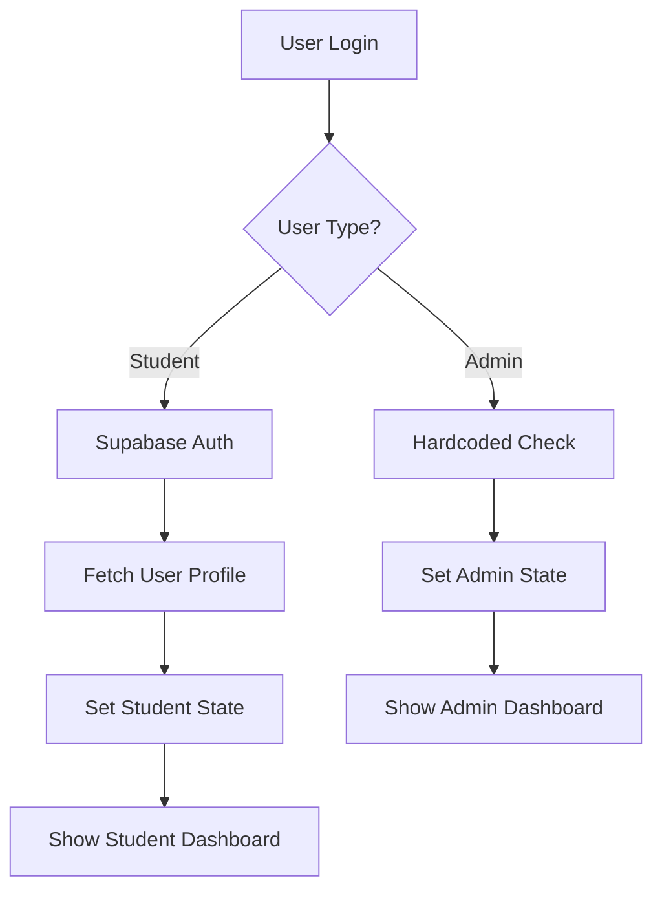

# AzureRaj Hub - Complete Setup Guide

## 🎯 **System Overview**

This system has **two types of authentication**:
- **Admin Login:** Hardcoded (no database) - `rapswamy0@gmail.com` / `AzureRaj2024!`
- **Student Login:** Supabase Auth + Database (auto-generated passwords)

All data (students, courses, interviews, etc.) is stored in Supabase database.

---

## 📋 **Step-by-Step Setup**

### **Step 1: Set Up Supabase Database**

1. **Go to Supabase Dashboard**
   - Visit [https://supabase.com](https://supabase.com)
   - Sign in to your account
   - Navigate to your project: `kaewhoozzlvtxeafxzcj`

2. **Run Database Setup Script**
   - Go to **SQL Editor**
   - Copy and paste the entire contents of `database-setup.sql`
   - Click **Run** to create all tables

3. **Verify Tables Created**
   - Go to **Table Editor**
   - You should see these tables:
     - `users` (for students only)
     - `students`
     - `courses`
     - `batches`
     - `course_content`
     - `interviews`
     - `placements`
     - `user_queries`
     - `resume_templates`

### **Step 2: Configure Authentication**

1. **Go to Authentication Settings**
   - Navigate to **Authentication** → **Settings**
   - Ensure **Email** is enabled
   - Set **Site URL** to `http://localhost:8081` (or your dev server URL)

2. **Configure Email Templates (Optional)**
   - Go to **Authentication** → **Email Templates**
   - Customize the confirmation and reset password emails

### **Step 3: Test the System**

1. **Start the Development Server**
   ```bash
   npm run dev
   ```

2. **Test Admin Login**
   - Go to `http://localhost:8081/admin/login`
   - Use credentials: `rapswamy0@gmail.com` / `AzureRaj2024!`
   - Should redirect to admin dashboard

3. **Test Student Login** (after creating a student)
   - Go to `http://localhost:8081/login`
   - Use student credentials (created by admin)

---

## 👨‍💼 **Admin Functions**

### **Adding New Students**

When admin adds a new student:

1. **Student Account Creation**
   - Admin enters student details (name, email, course, batch)
   - System automatically creates Supabase Auth user
   - Auto-generates a secure password
   - Sends login credentials to student via email

2. **Database Records**
   - Creates record in `users` table
   - Creates record in `students` table
   - Links student to course and batch

### **Managing Course Content**

1. **Add Course Materials**
   - Admin can add videos, documents, assignments
   - Content is linked to specific batches
   - Students see content based on their batch

2. **Interview Management**
   - Schedule interviews for students
   - Record feedback and scores
   - Track interview status

3. **Placement Tracking**
   - Record company placements
   - Track salary and position details
   - Monitor placement success rates

---

## 👨‍🎓 **Student Experience**

### **Student Login Process**

1. **Student receives credentials** from admin
2. **Logs in** with email and auto-generated password
3. **System fetches** student profile from database
4. **Shows dashboard** with course materials and progress

### **Student Features**

1. **Course Materials**
   - Access videos, documents, assignments
   - View content specific to their batch
   - Track learning progress

2. **Interview Schedule**
   - View scheduled interviews
   - See interview feedback and scores

3. **Resume Templates**
   - Download resume templates
   - Access career resources

---

## 🔧 **Technical Details**

### **Authentication Flow**



### **Database Schema**

- **users:** Student accounts only
- **students:** Student details and enrollment
- **courses:** Available courses
- **batches:** Course batches
- **course_content:** Learning materials
- **interviews:** Interview records
- **placements:** Job placements
- **user_queries:** Support tickets
- **resume_templates:** Resume resources

### **Security Features**

- **Row Level Security (RLS)** enabled on all tables
- **Students can only see their own data**
- **Admins can see all data** (hardcoded access)
- **Public access** to courses and resume templates

---

## 🚀 **Getting Started**

### **For Admins:**

1. **Login** with hardcoded credentials
2. **Add students** through the admin panel
3. **Upload course content** for different batches
4. **Schedule interviews** and track progress
5. **Monitor placements** and success rates

### **For Students:**

1. **Receive login credentials** from admin
2. **Login** to student portal
3. **Access course materials** for your batch
4. **View interview schedule** and feedback
5. **Download resume templates**

---

## 🛠️ **Troubleshooting**

### **Common Issues:**

1. **Student can't login**
   - Check if student exists in `users` table
   - Verify Supabase Auth user is created
   - Check email/password combination

2. **Admin can't access dashboard**
   - Verify hardcoded credentials
   - Check browser console for errors

3. **Database connection issues**
   - Verify Supabase URL and key
   - Check RLS policies
   - Ensure tables are created

### **Debug Steps:**

1. **Check browser console** for error messages
2. **Verify Supabase connection** in network tab
3. **Check database tables** in Supabase dashboard
4. **Test authentication** in Supabase Auth section

---

## 📞 **Support**

If you encounter issues:

1. **Check the console logs** for detailed error messages
2. **Verify Supabase setup** is complete
3. **Test with sample data** first
4. **Check RLS policies** if data access is restricted

---

## 🎉 **Success Indicators**

You'll know the setup is working when:

- ✅ Admin can login with hardcoded credentials
- ✅ Admin dashboard loads with all features
- ✅ Students can be added through admin panel
- ✅ Students can login with auto-generated passwords
- ✅ Student dashboard shows course materials
- ✅ All data is stored in Supabase database
- ✅ Profile dropdown appears when logged in
- ✅ Login button is hidden when authenticated

---

**Happy Learning! 🚀**
